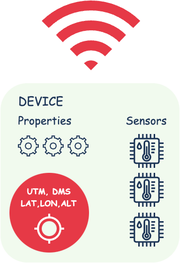

<h1 align="center">
  
   gpsgend
</h1>

gpsgend - tracker server based on predefined routes (GPX, GeoJSON)

This server can be used in testing and debugging applications or devices dependent on GPS/GLONASS/ETC, allowing you to simulate locations for checking their functionality without actual movement.
